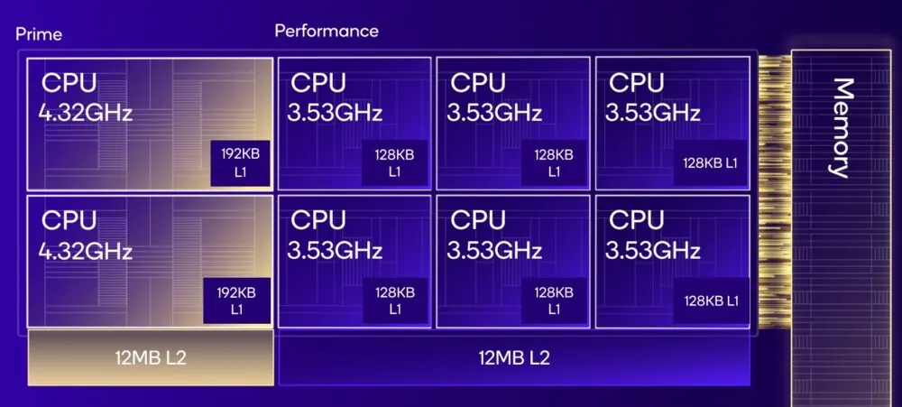

# Snapdragon X Series

## Examples

* Snapdragon X Elite X1E-84-100
* Snapdragon X Elite X1E-80-100
* Snapdragon X Elite X1E-78-100

## References

1.1. [Kryo: Qualcomm’s Last In-House Mobile Core](https://chipsandcheese.com/2023/07/12/kryo-qualcomms-last-in-house-mobile-core/)
1.2. [Hot Chips 2024: Qualcomm’s Oryon Core](https://chipsandcheese.com/2024/08/26/hot-chips-2024-qualcomms-oryon-core/)
1.3. [The Qualcomm Snapdragon X Architecture Deep Dive](https://www.anandtech.com/show/21445/qualcomm-snapdragon-x-architecture-deep-dive)

## Notes

* The Snapdragon X Elite will have 12 cores running up to 3.8 GHz, or up to 4.3 GHz using single- and dual-core boost. [1.3]

* Snapdragon Oryon v1 "Phoenix": [llm]
	- fp32 FLOPS/cy: 24  (3 × 128-bit FMA) 
	- i32 ops/cy:    12  (3 x 128-bit INT SIMD pipes)
	- L1 latency:     3 cycles (load-to-use)
	- L1 bandwidth:  64 B/cy  (2 × 128-bit load ports + 2 × 128-bit store ports)
	- L2 latency:    9-10 cycles
	- L2 bandwidth:  64 B/cy  (256-bit internal path, dual-bank)
	- Vector / matrix formats: fp32, fp16, bf16, int8/16/32, dot-product, 

* Snapdragon Oryon v1-LP: [llm]
	- fp32 FLOPS/cy: 16  (2 × 128-bit FMA pipes; lower area/power)
	- i32 OPS/cy:     8
	- L1 latency:     3 cycles
	- L1 bandwidth:  64 B/cy
	- L2 latency:    10-11 cycles
	- L2 bandwidth:  64 B/cy

# Snapdragon 8 Elite (Gen 4)

## Examples

## Notes

* 2x 4.3 GHz Oryon Gen 2 Prime *(similar to Cortex X4)*
* 6x 3.5 GHz Oryon Gen 2 Performance *(similar Cortex A720)*
* ARMv9.2

* Snapdragon Oryon v2 "Oryon Plus": [llm]
	- fp32 FLOPS/cy: 32  (2 × 256-bit FMA pipes)
	- i32 OPS/cy:    16
	- L1 latency:     3 cycles
	- L1 bandwidth:  128 B/cy  (2 × 256-bit loads + 2 × 256-bit stores)
	- L2 latency:    8-9 cycles
	- L2 bandwidth:  128 B/cy
	- Vector formats: fp32, fp16, bf16, fp8, int8/16/32/4, dot-product, SME2 tiles

## References

# Snapdragon 8 Elite 2 (Gen 5)

## Notes

* 100 TOPS NPU (i8 ?)
